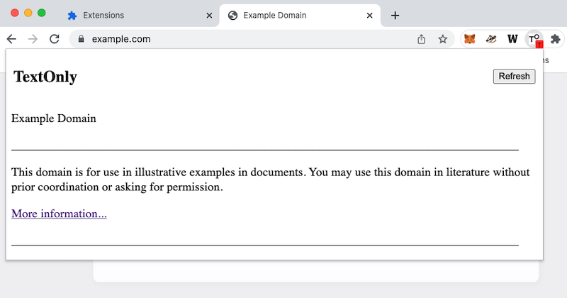
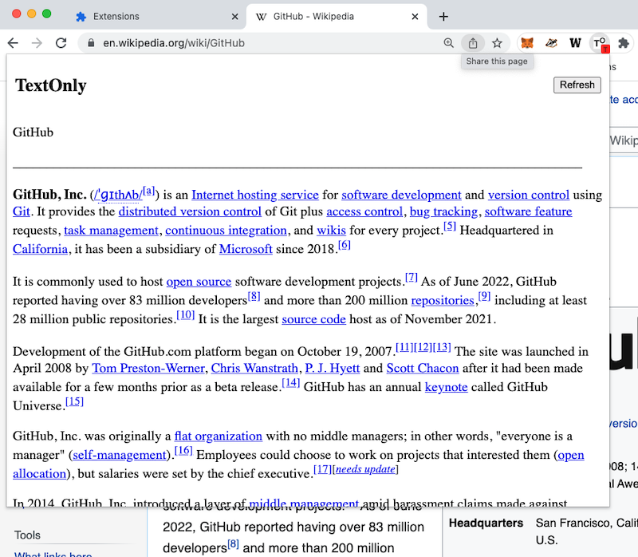

# TextOnly T<sup>O</sup>

Create a simplified page view. Remove photos, ads, or anything that distracts you from reading a web page.

## Setup

1. run `git clone https://github.com/greggzigler/textonly.git` in terminal
1. open `textonly/manifest.json` in an editor, and customize `content_scripts` with your target web page(s); see [below](#customizing) for details
1. open a Chrome web browser tab at `chrome://extensions/` or a Brave web browser tab at `brave://extensions/`
1. click the `Load unpacked` button
1. select the `textonly` folder
1. click the `Extensions` icon in the top right corner
1. click the Pin icon by the `TextOnly` entry

## Usage

1. open your target web page
1. click the `TextOnly` icon in the top right corner and see the popup dialog
1. if text does not appear in the popup within 3 seconds, click the `Refresh` button

## Customizing

Modify the `content_scripts` section of `manifest.json`. Match the target web site URLs that you want to visit; specify HTML class names and tag names to pinpoint the content that you want to see.

Here are the default settings:

```json
  "content_scripts": [
    {
      "js": ["/scripts/content.js"],
      "matches": [
        "https://example.com/*"
      ],
      "title": {
        "classes": [],
        "tags": ["h1"]
      },
      "core": {
        "classes": [],
        "tags": ["div", "body"]
      },
      "details": {
        "classes": [],
        "tags": ["p"]
      }
    }
  ],
```

Legend:

* `js`: internal files; do not modify
* `matches`: target websites
* `title`: where to find the page title
* `core`: where to find the body of content you want to see
* `details`: within `core`, where to find the individual pieces of content you want to see
* `classes`: ordered list of class names used in website HTML you want to see
* `tags`: ordered list of tag names used in website HTML you want to see

The extension code first looks in the HTML document for matching `classes` elements, one class at a time, until it finds one. If none are found, it does the same for `tags`.

Open [example.com](https://example.com/) in a web browser, and the extension popup should look like this:



### Customization Example

Go to the wikipedia page for [GitHub](https://en.wikipedia.org/wiki/GitHub) in the Chrome extension, open the `View Source` for the page, and look for HTML classes and tags for your desired content. For `wikipedia` you'll see that titles use the default `h1` and that details use the default `p`. But the core content uses a class name `mw-body-content`. So you can edit `matches` and `core` in the `manifest.json` file to look like this:

```json
  "content_scripts": [
    {
      "js": ["/scripts/content.js"],
      "matches": [
        "https://*.wikipedia.org/*"
      ],
      "title": {
        "classes": [],
        "tags": ["h1"]
      },
      "core": {
        "classes": ["mw-body-content"],
        "tags": []
      },
      "details": {
        "classes": [],
        "tags": ["p"]
      }
    }
  ],
```

Save the change, return the Step 3 of `Setup`, visit the [GitHub](https://en.wikipedia.org/wiki/GitHub) web page, and open the extension popup. It should look like this:


